# 🤖 AI News Sentiment Analyzer

An interactive web application that fetches the latest AI-related news and analyzes the sentiment of headlines and articles. Built with Python, Streamlit, and powered by NewsAPI.

## 🚀 Live Demo

🌐 **Try it live**: [https://huggingface.co/spaces/jonasneves/BootcampFinalProject](https://huggingface.co/spaces/jonasneves/BootcampFinalProject)

## 🛠️ Installation

### Prerequisites
- Python 3.9+ 
- NewsAPI key (get free at [newsapi.org](https://newsapi.org))

### Setup Instructions

1. **Clone the repository**
   ```bash
   git clone https://github.com/alexoh2bd/BootcampFinalProject
   cd BootcampFinalProject
   ```

2. **Create virtual environment**
   ```bash
   # macOS/Linux
   python3 -m venv .venv
   source .venv/bin/activate
   ```

3. **Install dependencies**
   ```bash
   pip install -r requirements.txt
   ```

4. **Set up environment variables**
   
   Create a `.env` file in the project root:
   ```bash
   NEWSAPI_KEY=your_newsapi_key_here
   ```

## 🎯 Usage

### Web Application

Run the Streamlit app:
```bash
streamlit run streamlit_app.py
```

Then open your browser to `http://localhost:8501`

### Command Line Interface

For quick sentiment analysis:

```bash
# Basic usage
python cli_demo.py

# Custom search query
python cli_demo.py --query "ChatGPT" --days 3

# Filter to specific sources
python cli_demo.py --sources "techcrunch,wired" --max-articles 5

# Show only positive articles
python cli_demo.py --positive-only

# Show detailed sentiment analysis
python cli_demo.py --sentiment-only
```

#### CLI Options
- `--query, -q`: Search query (default: "artificial intelligence")
- `--days, -d`: Days to look back (default: 7)
- `--sources, -s`: Comma-separated news sources
- `--max-articles, -m`: Maximum articles to display (default: 10)
- `--positive-only`: Show only positive sentiment articles
- `--negative-only`: Show only negative sentiment articles
- `--sentiment-only`: Show only sentiment analysis summary

## 🔧 Technical Architecture

```mermaid
flowchart TB
    subgraph Frontend["🎨 Frontend Layer"]
        A["🌐 Streamlit UI"]
        B["💻 CLI Interface"]
    end
    
    subgraph Application["⚙️ Application Layer"]
        C["api_handler.py<br/>🔧 Core Logic"]
        D["streamlit_app.py<br/>📊 Web Framework"]
        E["cli_demo.py<br/>⌨️ Command Line"]
    end
    
    subgraph Processing["🧠 Data Processing"]
        F["TextBlob + VADER<br/>Sentiment Engines"]
        G["Plotly<br/>Visualizations"]
        H["Pandas<br/>Data Processing"]
    end
    
    subgraph External["🌐 External Services"]
        I["📡 NewsAPI<br/>TechCrunch, Wired, etc."]
        J["🔐 Environment<br/>API Keys"]
    end
    
    A --> D
    B --> E
    D --> C
    E --> C
    C --> F
    C --> H
    D --> G
    C --> I
    C --> J
    
    classDef frontend fill:#1f6feb,stroke:#58a6ff,stroke-width:2px,color:#f0f6fc
    classDef application fill:#2ea043,stroke:#3fb950,stroke-width:2px,color:#f0f6fc
    classDef processing fill:#a371f7,stroke:#d2a8ff,stroke-width:2px,color:#f0f6fc
    classDef external fill:#f85149,stroke:#ff7b72,stroke-width:2px,color:#f0f6fc
    
    class A,B frontend
    class C,D,E application
    class F,G,H processing
    class I,J external
```



## 📈 Example Output

### CLI Example
```bash
🤖 AI News Sentiment Analyzer
==================================================

🔍 Searching for: "artificial intelligence"
📅 Looking back: 7 days

📰 Found 43 articles

Sentiment Distribution:
  😊 Positive: 18 articles (41.9%)
  😐 Neutral: 15 articles (34.9%)
  😞 Negative: 10 articles (23.2%)

📄 Top 10 Articles:
--------------------------------------------------------------------------------
 1. 😊 [TechCrunch] 2024-01-20 14:30
    AI startup raises $50M for breakthrough in healthcare diagnosis
    Sentiment: Positive (Score: 0.45)
    📝 Revolutionary AI technology promises to transform medical diagnosis...
    🔗 https://techcrunch.com/...

 2. 😞 [Reuters] 2024-01-20 12:15
    Concerns grow over AI job displacement in manufacturing
    Sentiment: Negative (Score: -0.32)
    📝 Labor unions express worry about automation replacing workers...
    🔗 https://reuters.com/...
```

## 🤝 Contributing

This project was built as part of the Duke AIPI 503 Bootcamp.

### Development Setup

1. Fork the repository
2. Create a feature branch: `git checkout -b feature/some-feature`
3. Make your changes and commit: `git commit -m 'Add some feature'`
4. Push to the branch: `git push origin feature/some-feature`
5. Open a Pull Request

## 📝 License

This project is licensed under the MIT License - see the LICENSE file for details.
